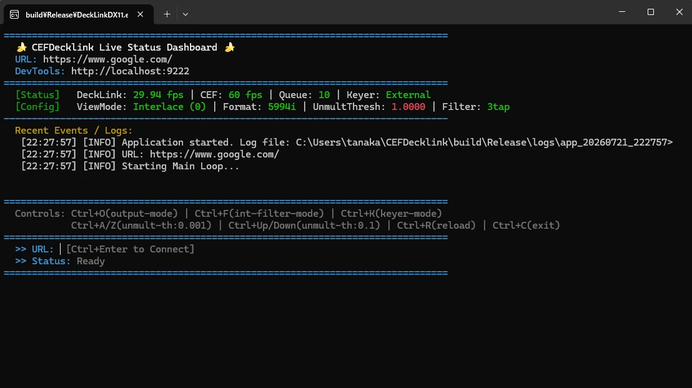

# CEFDecklink (日本語版)

[English Version (英語版)はこちら](README.md)

CEFDecklink は、**組み込みのブラウザ（Chromium Embedded Framework; CEF）で描画した Web ページを、1080i59.94 または 1080i50 の出力レートで、SDI から「ストレートアルファの Fill と Key」に分離出力できる、軽量・単機能かつ安定性に優れた放送品質のオープンソースソフトウェア**です。

ノートPCと **Blackmagic UltraStudio HD Mini** などの DeckLink デバイスを接続するだけで、映像スイッチャーでの完璧なグラフィック（テロップや CG）の半透明合成を実現します。

> [!TIP]
> **機材なしで今すぐ簡単にお試しいただけます！**  
> UltraStudio などの SDI 出力デバイスが手元にない場合でも、Windows PC さえあれば自動的に「シミュレーターモード（PC上のプレビューウィンドウ描画）」で起動します。HTML/WebGL アニメーションの滑らかさやツールの挙動をその場ですぐにテスト可能です。

---

## ✨ 主な特徴

1. **Unmultiplied Keying（フリンジ対策のビルトイン）**  
   Webベースの半透明なグラデーションやドロップシャドウをスイッチャー上で合成した際に、エッジが黒ずむ問題（フリンジ）を解消するための「Unmultiplied フィルター」を標準装備。完璧なストレートアルファ合成を可能にします。

2. **60fps Free-Run CEF（滑らかなアニメーション）**  
   内部ブラウザ（CEF）を 60fps で自律駆動させ、非同期・ロックフリーなキューを用いて 29.97fps (59.94i) のハードウェア出力と完全同期。HTML アニメーションのカクつき（スタッター）や停止時の振動（ジッター）を防ぎます。

3. **複数の出力モード切替**  
   インターレース標準出力 / プログレッシブ / 30p Blend（モーションブラー風残像合成）/ Diff（差分デバッグ表示）を実行中にホットキーで即時切替可能。

4. **垂直ローパスフィルター（インターレースフリッカー対策）**  
   細い横線パターンのフリッカー（インターレース縞）を、GPU Compute Shader による 3-tap / 5-tap 垂直 LPF で軽減。映像品質をソフトウェアレベルで最適化します。

5. **外部キーイングモード**  
   ハードウェア外部キーイングモードをサポートし、スイッチャー側でのキー合成にも対応します。

6. **DirectX 11 GPU処理**  
   Compute Shader を活用した効率的な GPU ベースのテクスチャ共有・インターレース Weave 合成・色空間変換を実現。CPU 負荷を最小限に抑えます。

7. **シミュレーターモード**  
   DeckLink デバイスが接続されていない PC で起動した場合、自動的に「シミュレーターモード（ウィンドウプレビュー）」にフォールバックします。現場に機材がない状態でも Web グラフィックの描画確認が可能です。

特に以下の構成に合わせて構成・検証されています：
- **デバイス**: **UltraStudio HD Mini** (Thunderbolt 接続 / および同等の DeckLink デバイス)
- **フォーマット**: **1080i59.94** (NTSC) / **1080i50** (PAL)
- **出力**:
  - **SDI A**: Fill 信号
  - **SDI B**: Key 信号

---

## 開発環境の構築（要件）

本プロジェクトをビルドし、環境を再構築するために必要な要件です。

1. **Windows 10 または 11 (x64)**
2. **Visual Studio 2022** (標準的なMSVC C++ツールチェーン)
   - インストール時のワークロードで `C++ によるデスクトップ開発` を含めてください。
   - 「個別のコンポーネント」で `C++ CMake ツール (Windows)` および `Windows 11 SDK` (または10) がインストールされていることを確認してください。
3. **Blackmagic Desktop Video ドライバ**
   - 実行・テストする対象のPCにインストールされている必要があります。

---

## クローンと依存関係のセットアップ

プロジェクトのビルドを成功させるには、依存関係（CEFとDeckLink SDK）を正しいフォルダ名で配置することが**最も重要**です。

### 1. リポジトリのクローン
```powershell
git clone <repository-url>
cd CEFDecklink
```

### 2. 外部ライブラリ (`vender` フォルダ) の手動配置

プロジェクトルートの `vender` ディレクトリに以下の2つを配置します。ファイルが見つからない、またはフォルダ名が違うとCMakeの構成に失敗します。

**A. Chromium Embedded Framework (CEF)**
1. [CEF Builds](https://cef-builds.spotifycdn.com/index.html) から **Windows 64-bit** 用の **Standard Distribution** (例: `CEF 132.0.26+gea273c5+chromium-132.0.6834.83`) (tar.bz2形式) をダウンロードします。
2. アーカイブを解凍します。（Windows標準で解凍できない場合は 7-Zip 等を使用してください）
3. 解凍してできたフォルダ（`cef_binary_...` 等）の名前を必ず `cef` に変更します。
4. `vender/cef` となるように配置します。

**B. Blackmagic DeckLink SDK**
1. [Blackmagic Design Developer Website](https://www.blackmagicdesign.com/developer/) から **Desktop Video SDK 15.3** (または 14.0+) をダウンロードします。
2. アーカイブを解凍します。
3. SDKフォルダをそのまま `vender` ディレクトリに配置します。

#### 最終的な必須ディレクトリ構成
以下のようになっていることを確認してください。
```text
CEFDecklink/
 ├─ vender/
 │   ├─ Blackmagic DeckLink SDK 15.3/   <-- この名前（バージョン部分含む）
 │   │   └─ Win/
 │   │       └─ include/
 │   │           └─ DeckLinkAPI.idl     <-- CMakeがこれを探します
 │   └─ cef/                            <-- cef_binary_... からリネーム
 │       ├─ cmake/
 │       └─ CMakeLists.txt              <-- CMakeがこれを探します
 ├─ src/
 ├─ CMakeLists.txt
 ├─ build.bat
 └─ ...
```

---

## プロジェクトのビルド手順

環境構築とフォルダ準備が完了したら、付属のバッチスクリプトを実行するだけでビルドが完了します。

コマンドプロンプトまたはPowerShellで以下を実行します：
```powershell
.\build.bat
```

**`build.bat` が自動で行うこと:**
1. Visual Studio 2022の `MSBuild.exe` および `cmake.exe` のパスを自動特定します。
2. `cmake -S . -B build` でCMakeプロジェクトを生成します。
3. `cmake --build build --config Release` でReleaseモードのビルドを実行します。
4. 必要なリソース（CEFバイナリ、シェーダー、`config.json`）を `build\Release` ディレクトリに自動コピーします。

---

## 実行とインストール

### セキュリティ警告について
- **SmartScreenの警告:** 個人開発のため、実行ファイルに対するデジタル署名（コードサイニング証明書）を取得していません。初回実行時に Windows Defender SmartScreen による青い警告画面が表示される場合があります。その場合は、画面内の **「詳細情報」** をクリックし、**「実行」** を押すことで起動できます。
- **ファイアウォールの警告:** 内部ブラウザ（CEF）が開発者ツール（DevTools）接続用のポートを開くため、Windows ファイアウォールの警告が表示されることがあります。開発者ツールを使用しない場合は、通信を **「キャンセル（許可しない）」** としても本ソフトウェアの送出機能は問題なく動作します。

### パッケージマネージャー（推奨）

Windows および macOS のパッケージマネージャーを使用して、簡単にインストールおよびアップデートを行うことができます。

#### Scoop (Windows)
以下のコマンドを実行してバケットを追加し、インストールします：
```powershell
scoop bucket add cefdecklink https://github.com/tanaka-ryuya/scoop-cefdecklink.git
scoop install cefdecklink
```
インストール完了後、任意のコマンドプロンプトまたはPowerShellから以下のコマンドでアプリを起動できます：
```powershell
cefdecklink
```

#### Homebrew (macOS Cask)
以下のコマンドを実行してリポジトリをタップし、インストールします：
```bash
brew tap tanaka-ryuya/cefdecklink
brew install --cask cefdecklink
```
インストール完了後、アプリケーションフォルダから、または以下のコマンドを使って起動できます：
```bash
# GUIアプリケーションバンドルとして起動する場合
open -a DeckLinkDX11

# 直接コマンドラインからバイナリを実行する場合
/Applications/DeckLinkDX11.app/Contents/MacOS/DeckLinkDX11
```

### ポータブル（ZIP）での配布・実行（手動）
本アプリケーションはインストーラーを使用しないポータブル配布形式となっています。
他のPCへ持ち運びやデプロイを行う際は、ビルド出力である `build/Release` フォルダ全体をZIPにアーカイブしてコピーし、任意の場所（書き込み権限のあるユーザーフォルダ推奨）に展開して実行してください。

### ビルドフォルダから直接実行する場合
バッチスクリプトでビルド成功後、以下のパスから直接実行できます。
```powershell
.\build\Release\DeckLinkDX11.exe
```
※実行ファイルの隣に `libcef.dll` や `shaders` フォルダ、`config.json` が正しく配置されている必要があります（`build.bat` の完了時に自動でコピーされます）。

---

## アプリケーションの設定

起動時のURLやアルファ閾値は以下の優先順位で決定されます：
1. **コマンドライン引数**
2. **`config.json`** (実行ファイルと同じディレクトリ)
3. **デフォルト値**

### 1. コマンドライン引数
```powershell
.\DeckLinkDX11.exe --url "http://localhost:3000/cg" --unmult_thresh 0.5 --il_filter_mode 1
```
- `--url`: 読み込む初期URLを指定します。
- `--unmult_thresh`: 初期のUnmultiply用アルファ閾値を設定します (0.0 - 1.0)。
- `--il_filter_mode`: 垂直ローパスフィルタのモードを設定します (0: なし, 1: 3-tap, 2: 5-tap)。

### 2. config.json
`DeckLinkDX11.exe` の隣（ビルドディレクトリ、またはインストール先）の `config.json` で設定を固定化できます：
```json
{
    "url": "https://google.com",
    "unmult_thresh": 0.0,
    "format": "5994i",
    "il_filter_mode": 1
}
```
- `url`: The web page to render (default: "https://example.com")
- `unmult_thresh`: The threshold for unmultiplied processing (default: 0.0, perfectly straight alpha)
- `format`: SDI output format. Only two values are supported: "5994i" or "50i" (default: "5994i")
- `il_filter_mode`: Interlace vertical filter mode (0=None, 1=3-tap, 2=5-tap) (default: 1)


## 操作と機能 (コンソール TUI ショートカット)

本アプリケーションは、**コマンドプロンプト等のコンソールウィンドウ** にて TUI (Text User Interface) によるステータス表示を行います。



コンソールウィンドウにフォーカスがある状態で、以下のショートカットキーが使用できます：

### Windows版ショートカット
- **`Ctrl + O`** : **ビューモードの切り替え** (0: Interlace 標準 / 1: Diff 差分可視化 / 2: Progressive / 3: 30p Blend)
- **`Ctrl + F`** : **垂直LPF（低域通過フィルタ）モードの切り替え** (なし / 3-tap LPF / 5-tap LPF)
- **`Ctrl + K`** : **Keyerモードの切り替え** (Internal 内蔵 / External 外部)
- **`Ctrl + A` / `Ctrl + Z`** : Unmultアルファ閾値の微調整 (+0.001 / -0.001)
- **`Ctrl + Up` / `Ctrl + Down`** : Unmultアルファ閾値の粗調整 (+0.1 / -0.1)
- **`Ctrl + R`** : ページの強制リロード (キャッシュ無視)
- **`Ctrl + C`** : アプリケーションの安全な終了

### macOS版ショートカット
- **`Ctrl + P`** : **ビューモードの切り替え** (0: Interlace 標準 / 1: Diff 差分可視化 / 2: Progressive / 3: 30p Blend)
- **`Ctrl + F`** : **垂直LPF（低域通過フィルタ）モードの切り替え** (なし / 3-tap LPF / 5-tap LPF)
- **`Ctrl + K`** : **Keyerモードの切り替え** (Internal 内蔵 / External 外部)
- **`<` / `>`** (Shift+`,`/`.`): Unmultアルファ閾値の微調整 (+0.001 / -0.001)
- **`Ctrl + [` / `Ctrl + ]`** (または `Ctrl + Up` / `Ctrl + Down`): Unmultアルファ閾値の粗調整 (+0.1 / -0.1)
- **`Ctrl + R`** : ページの強制リロード (キャッシュ無視)
- **`Ctrl + C`** : アプリケーションの安全な終了

---
※GUIプレビューウィンドウがアクティブな状態で **`F11`** を押すと、プレビューの全画面表示の切り替えが可能です。

## トラブルシューティング

- **ビルド時のエラー: "CMake Error at ... include(cef_variables)"**
  → CEFフォルダの名前が `vender/cef_binary_...` になっていませんか？ フォルダ名を `cef` に変更してください。
- **ビルド時のエラー: "DeckLink SDK not found"**
  → `vender/Blackmagic DeckLink SDK 15.3` のパスが存在するか、`DeckLinkAPI.idl` が正しい位置にあるかツリー構成を確認してください。
- **起動時のエラー: "Shader Compile Failed"**
  → 実行ファイルの隣に `shaders` フォルダがコピーされているか確認してください。コピー漏れがある場合は `src/render/shaders` を手動でコピーしてください。
- **起動時のメッセージ: "Decklink not found"**
  → DeckLinkドライバがインストールされていないか、対象デバイスが見つかりません。アプリは自動的に**シミュレーターモード**で起動し、プレビューを続行します。
- **起動時のクラッシュ: "Invalid file descriptor to ICU data"**
  → `libcef.dll` 等のCEFライブラリが実行ディレクトに不足しています。ビルドスクリプトが最後まで正常に完了したか確認してください。

---

## 関連ドキュメント / Documentation & References

本プロジェクトの内部仕様や検証に役立つシミュレータ、日本語・英語の各種ドキュメントです。

### データ処理フロー仕様書 (Data Processing Flow Specification)
*   **[日本語版: data_processing_flow.md](docs/data_processing_flow.md)**
*   **[英語版: data_processing_flow_en.md](docs/data_processing_flow_en.md)**
    *   CEFからDeckLinkへのスレッド間同期、タイムスタンプベースのバッファリング、Compute Shaderによるインターレース Weave 合成や Unpremultiply 処理などの詳細仕様。

### パイプラインシミュレータ (Pipeline Simulator)
*   **[日本語版 Webシミュレータを開く（ブラウザで直接実行）](https://htmlpreview.github.io/?https://github.com/tanaka-ryuya/CEFDecklink/blob/main/docs/pipeline_simulator.html)** ([ソースファイル](docs/pipeline_simulator.html))
*   **[英語版 Webシミュレータを開く（ブラウザで直接実行）](https://htmlpreview.github.io/?https://github.com/tanaka-ryuya/CEFDecklink/blob/main/docs/pipeline_simulator_en.html)** ([ソースファイル](docs/pipeline_simulator_en.html))
    *   CEFのフリーラン(60fps)からDeckLink(59.94i)へのフレーム蓄積・消費・ドロップ判定、Compute Shaderや垂直LPFの挙動、1画素単位の色計算（Unpremultiply）をWeb上で視覚的に検証・解析できるインタラクティブシミュレータ。

---

## ライセンス

本プロジェクトは MIT ライセンスの元で公開されています。詳細は [LICENSE](LICENSE) ファイルをご覧ください。
