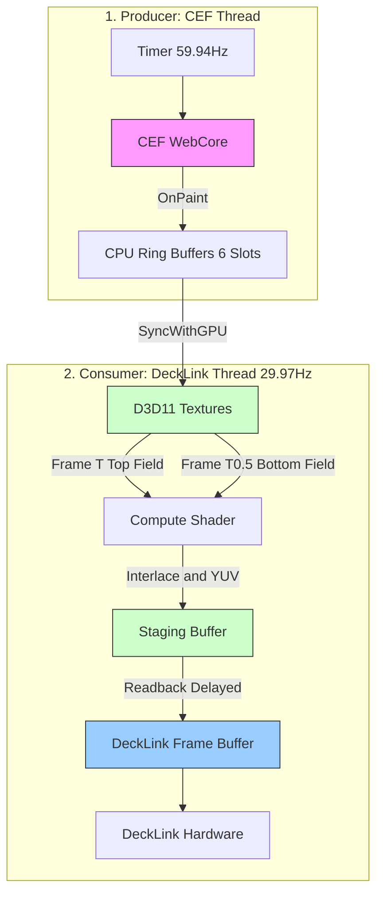

# データ処理フロー詳細仕様書

本ドキュメントでは、CEF (Chromium Embedded Framework) から DeckLink への映像出力に至るまでのデータ処理パイプラインの詳細を記述する。
現在の実装に基づき、各ステージの **駆動トリガー**、**動作レート**、および **同期メカニズム** に焦点を当てて解説する。

---

## 1. システムアーキテクチャ概要

本システムは、オフスクリーンで動作するWebレンダリングエンジン (CEF) の出力を、厳密な固定フレームレート (59.94i) を要求する放送用ハードウェア (DeckLink) へ送り届けるブリッジアプリケーションである。
**CEFスレッド (プロデューサー)** と **DeckLinkスレッド (コンシューマー)** が独立して動作し、D3D11と共有バッファを用いて効率的に同期するメカニズムを特徴とする。

### データフロー図 (概念)

---

## 2. バッファリングとスレッド間同期戦略

本アプリケーションは、処理落ち（ドロップフレーム）や遅延を防ぐため、複数のバッファリング層を持っている。

### ステージ 1: CEF レンダリング (Producer)
- **担当クラス**: `CefManager`, `CefRenderHandlerImpl`
- **駆動トリガー**: CEF UIスレッド上の自己完結型タイマー (`TriggerBeginFrame`)
- **動作レート**: 約 **59.94 fps** (16.68ms間隔)
- **ロジック**:
    - CEFの内部ペーシング（VSync）は無効化されており、アプリケーション側から `SendExternalBeginFrame()` と `Invalidate(PET_VIEW)` を送ることで描画を強制する。
    - `OnPaint` コールバックは専用のCPUメモリ上のリングバッファ (`m_cpuBuffers`, `kBufferCount = 6`) にピクセルデータをコピーする。
    - 書き込みポインタ (`m_writeIndex`) をアトミックにインクリメントすることで、コンシューマー側に新しいフレームの存在を通知する（短時間のミューテックスロックを使用）。

### ステージ 2: GPU アップロード (Consumer 1)
- **担当関数**: `CefRenderHandlerImpl::SyncWithGPU()`
- **駆動トリガー**: DeckLinkのコールバック内からポーリング実行される。
- **ロジック**:
    - DeckLinkスレッドは次のフレームを出力する直前に、CEF側で溜まっている未アップロードのフレームを**すべて** D3D11テクスチャへアップロード（Drain）する。
    - アップロードは `Map/Unmap` を用いて行われ、メインメモリーからVRAMへのコピーとなる。
    - 直近の2フレーム分の `ShaderResourceView` (SRV) を `m_historySRVs`（Top用, Bottom用）として保持する。

---

## 3. シェーダー処理とインターレース合成 (Consumer 2)

- **担当クラス**: `ShaderManager`
- **実行スレッド**: DeckLink Video Output Thread
- **動作レート**: **29.97 fps (Interlaced Frame Generation)**
- **ロジック**:
    1.  **Compute Shader Dispatch (`YUVConvert.hlsl`)**:
        - **入力**: 連続する2枚のプログレッシブフレーム (59.94p 相当)
            - `t0`: 少し古いフレーム (Top Field に適用)
            - `t1`: 最新のフレーム (Bottom Field に適用)
        - **処理内容**: 
            - 偶数ラインは `t0` のピクセル、奇数ラインは `t1` のピクセルからサンプリングを行う（Weave合成）。
            - ARGB (RGB + アルファ) から UYVY または v210 等のYUV形式へ色空間変換を行う。
            - 引数 `--alpha` (閾値) に基づいて、Unmultiplied アルファ（FillとKeyの分離）処理の調整を行う。
        - **出力**: 1枚のインターレースフレーム (59.94i)用テクスチャ。
    
    2.  **遅延リードバック (Pipelined Readback)**:
        - GPUからCPUメモリ（DeckLinkバッファ）への読み出し（Readback）は極めて重い処理である。
        - パフォーマンス低下を防ぐため、**2フレーム前（出力フレーム換算）** に処理が完了したステージング・バッファを `Map` して読み出す。
        - 読み出したデータを DeckLink の出力バッファ (`pBuffer`) へ `memcpy` する。

---

## 4. フレームレイテンシとシーケンス

**59.94p -> 59.94i 変換および出力フロー**

全体として、CEFで描画されたフレームが実際にDeckLinkハードウェアから出力されるまでには、**意図的なパイプライン遅延（約2 Tick = 約66ms + CEFバッファ遅延）** が存在する。

| 時間軸 (DL Tick) | アクション (DLスレッド内) | 状態 |
| :--- | :--- | :--- |
| **Tick N** | CEFフレームを VRAM (Tex A, B) にアップロード `ShaderManager` が Tex A, B を合成して `Staging[0]` へ出力 | `Staging[0]` 生成開始 (GPU上) |
| **Tick N+1** | 次のCEFフレームたちを VRAM にアップロード `ShaderManager` が合成して `Staging[1]` へ出力 | `Staging[1]` 生成開始 |
| **Tick N+2** | 次のCEFフレームたちを VRAM にアップロード **`Staging[0]` からCPUへ非同期 Readback** DeckLinkへスケジュール | **`Staging[0]` (Tick N生成分) がハードウェアへ送出される** |

これにより、時間解像度が 59.94Hz の滑らかな放送品質モーションが保証されたまま、スレッド群がブロックされることなくスループット 29.97fps (Interlaced) を達成する。

---

## 5. 安定化とパフォーマンス最適化

1.  **プロセス優先度とスレッド制御**:
    - `HIGH_PRIORITY_CLASS` に設定し、OSスケジューラによる優先的なCPU割り当てを確保。
    - CEF 렌더링 스レッドと DeckLink の Output コールバックスレッドは独立して走り、リングバッファを用いることで互いにブロックしない。
2.  **バックグラウンド抑制の無効化**:
    - ウィンドウ非表示時でもCEFがフルスピードで動作するよう、起動オプションに `--disable-renderer-backgrounding`, `--disable-background-timer-throttling` 等を適用。
3.  **UIモニタリング**:
    - 毎秒のシステム状態（FPS, Queueサイズなど）は `main.cpp` のメインループ (`RenderFrame`) で集計され、コンソールにリアルタイム表示される。
    - `DL` (29.97に近い値) と `CEF` (60前後の値) の両方が安定している状態が「理想のロック状態」である。
