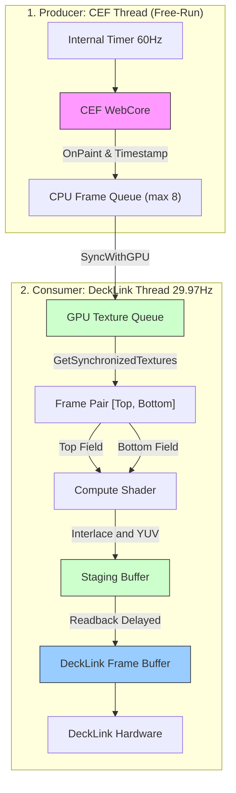

# データ処理フロー詳細仕様書

本ドキュメントでは、CEF (Chromium Embedded Framework) から DeckLink への映像出力に至るまでのデータ処理パイプラインの詳細を記述する。
現在の実装（CEFフリーラン＋スタッター防止同期機構）に基づき、各ステージの **駆動トリガー**、**動作レート**、および **同期メカニズム** に焦点を当てて解説する。

---

## 1. システムアーキテクチャ概要

本システムは、オフスクリーンで動作するWebレンダリングエンジン (CEF) の出力を、厳密な固定フレームレート (59.94i) を要求する放送用ハードウェア (DeckLink) へ送り届けるブリッジアプリケーションである。
**CEFスレッド (プロデューサー)** と **DeckLinkスレッド (コンシューマー)** が独立して動作し、タイムスタンプ付きのフレームキューを用いて効率的かつ滑らかに同期するメカニズムを特徴とする。

### データフロー図 (概念)

---

## 2. バッファリングとスレッド間同期戦略

本アプリケーションは、処理落ち（ドロップフレーム）や遅延を防ぎつつ、最も滑らかなモーションを出力するための同期ロジック（CasparCGアーキテクチャ踏襲）を実装している。

### ステージ 1: CEF レンダリング (Producer)
- **担当クラス**: `CefManager`, `CefRenderHandlerImpl`
- **駆動トリガー**: CEF内部タイマー (フリーラン)
- **動作レート**: **60 fps** (`windowless_frame_rate = 60`)
- **ロジック**:
    - 以前の手動駆動 (`DriveExternalBeginFrame`) を廃止し、CEF自身の自律的な高精度タイマーでレンダリングを行う（フリーラン方式）。
    - これによりWindowsの15.6msタイマー分解能によるジッター（遅延）を回避し、安定した60fpsのフレーム供給を実現。
    - `OnPaint` コールバックでピクセルデータをコピーする際、その瞬間の `std::chrono::steady_clock` をタイムスタンプとして記録する。

### ステージ 2: GPU アップロードと同期キュー (Consumer 1)
- **担当関数**: `CefRenderHandlerImpl::SyncWithGPU()`, `GetSynchronizedTextures()`
- **駆動トリガー**: DeckLinkのコールバック (`ScheduledFrameCompleted`) 内から約33.36ms間隔でポーリング実行。
- **ロジック**:
    - **アップロード**: CEF側で溜まっている未アップロードのフレームをD3D11テクスチャへアップロードし、タイムスタンプと共にキュー (`m_readyTextures`) に追加する。
    - **ペアの取り出し (時間ベース・プレロール機構)**:
        - 新たなフレーム供給（キュー0枚から1枚以上の増加）を検知すると、直ちに消費を開始するのではなく **2サイクルのコールバック（約66ミリ秒）の意図的な遅延（プレロール）** を設ける。
        - **通常アニメーション時**: この66ミリ秒の間にCEFから4〜6枚のフレームがキューに貯金される。消費開始後は、OSタイマーのジッターによってCEFの生成が一瞬遅れた際も、この貯金から安定して2枚ずつフレームを引き出せるため、不規則なカクつき（微小ジッター）が完全に吸収される。
        - **静止画（カット出し）時**: CEFから1枚のフレームのみが供給され後続が来ない場合も、66ミリ秒の遅延後にその1枚が取り出され、TopとBottomの両フィールドに複製されて静止画として正しく出力される。
        - **アニメーション停止時 (キュー空渇)**: CEFからの供給が止まりキューが空（0枚）になると、消費フェーズを終了し、再びプレロール待機タイマーをリセットする。待機中およびプレロール進行中は「前回最後に表示したフレーム」を両フィールドに複製出力し、画面のブレ（時間逆行）を防ぎ完全静止（Freeze）を維持する。

---

## 3. ビューモード (g_viewMode) と TUI コントロール

本システムは、コンソール上の TUI (Text User Interface) にて修飾キー（`Ctrl`）を用いたホットキー操作で、レンダリングやシェーダーの動作モードをリアルタイムに切り替える機能を持つ。

| モード値 | TUI ホットキー | 名称 | 動作仕様 |
| :---: | :--- | :--- | :--- |
| **0** | `Ctrl + I` | **Interlace (標準)** | CEFは60fpsフリーラン。シェーダーで前後フレームをWeave合成し、1080i映像として出力する。 |
| **1** | `Ctrl + D` | **Diff (差分)** | CEFは60fpsフリーラン。前後フレームの差分(`abs(p1 - p2)`)を出力し、動いているピクセルのみを可視化する。静止時は真っ黒になる。 |
| **2** | `Ctrl + P` | **Progressive** | CEFは60fpsフリーラン。実機ではFrame1のみを使った29.97p出力。ウィンドウプレビュー表示時はダブルパンプによる60pプレビューとなる。 |
| **3** | `Ctrl + B` | **30p Blend** | CEF描画の消費を半分に間引き、シェーダー側で前後のコマを50%ずつブレンドして滑らかなモーションブラーを生成する（現在はフリーラン移行に伴い挙動調整の対象）。 |

※アルファ閾値 (`g_alphaThreshold`) は `Ctrl + A` (Up) / `Ctrl + Z` (Down) で調整可能。
※ **`Ctrl + C`** でアプリケーションを安全に終了できます。

---

## 4. シェーダー処理とインターレース合成 (Consumer 2)

- **担当クラス**: `ShaderManager`
- **実行スレッド**: DeckLink Video Output Thread
- **動作レート**: **29.97 fps (Interlaced Frame Generation)**
- **ロジック**:
    1.  **Compute Shader Dispatch (`YUVConvert.hlsl`)**:
        - **入力**: `GetSynchronizedTextures()` から取得した連続する2枚のプログレッシブフレーム。
            - `t0`: 少し古いフレーム (Top Field に適用)
            - `t1`: 最新のフレーム (Bottom Field に適用)
        - **処理内容**: 
            - 偶数ラインは `t0` のピクセル、奇数ラインは `t1` のピクセルからサンプリングを行う（Weave合成）。
            - ARGB (RGB + アルファ) から UYVY または v210 等のYUV形式へ色空間変換を行う。
            - 引数 `--alpha` (閾値) に基づいて、Unmultiplied アルファ（FillとKeyの分離）処理の調整を行う。
        - **出力**: 1枚のインターレースフレーム (59.94i)用テクスチャ。
    
    2.  **遅延リードバック (Pipelined Readback)**:
        - GPUからCPUメモリ（DeckLinkバッファ）への読み出し（Readback）は極めて重い処理である。
        - パフォーマンス低下を防ぐため、**2フレーム前（出力フレーム換算）** に処理が完了したステージング・バッファを `Map` して読み出す。
        - 読み出したデータを DeckLink の出力バッファ (`pBuffer`) へ `memcpy` する。

---

## 5. フレームレイテンシとシーケンス

**60p -> 59.94i 変換および出力フロー**

全体として、CEFで描画されたフレームが実際にDeckLinkハードウェアから出力されるまでには、**意図的なパイプライン遅延（約2 Tick = 約66ms + CEFバッファ同期遅延）** が存在する。

| 時間軸 (DL Tick) | アクション (DLスレッド内) | 状態 |
| :--- | :--- | :--- |
| **Tick N** | CEFキューからペア(A, B)を取得し VRAM へアップロード `ShaderManager` が合成して `Staging[0]` へ出力 | `Staging[0]` 生成開始 (GPU上) |
| **Tick N+1** | 次のペア(C, D)を取得し VRAM へアップロード `ShaderManager` が合成して `Staging[1]` へ出力 | `Staging[1]` 生成開始 |
| **Tick N+2** | 次のペア(E, F)を取得し VRAM へアップロード **`Staging[0]` からCPUへ非同期 Readback** DeckLinkへスケジュール | **`Staging[0]` (Tick N生成分) がハードウェアへ送出される** |

これにより、時間解像度が 60Hz の滑らかな放送品質モーションが保証されたまま、スレッド群がブロックされることなくスループット 29.97fps (Interlaced) を達成する。

---

## 6. 安定化とパフォーマンス最適化

1.  **プロセス優先度とスレッド制御**:
    - `HIGH_PRIORITY_CLASS` に設定し、OSスケジューラによる優先的なCPU割り当てを確保。
    - CEFレンダリングスレッド（フリーラン）と DeckLink 出力コールバックスレッド（29.97Hzタイマー駆動）は完全に独立して走り、タイムスタンプ付きキューにより非同期にデータを授受する。
2.  **バックグラウンド抑制の無効化**:
    - ウィンドウ非表示時でもCEFがフルスピードで動作するよう、起動オプションに `--disable-renderer-backgrounding`, `--disable-background-timer-throttling` 等を適用。
3.  **UIモニタリングとログ**:
    - 毎秒のシステム状態（FPS, Queueサイズなど）や現在のURL設定は `main.cpp` のメインループ (`RenderFrame`) で集計され、コンソールにリアルタイム表示される。
    - 旧仕様での「同期LOCKED」表示や不要なストール警告(0fps)ログは廃止され、フリーランアーキテクチャに準じたクリーンなモニタリングとなっている。
    - フリーラン時は、CEF側でアニメーションが行われている間はCEF FPSが約60をキープし、キューサイズが安定して消費される状態が理想的である（アニメーション停止時はFPS0となるが正常な動作）。
