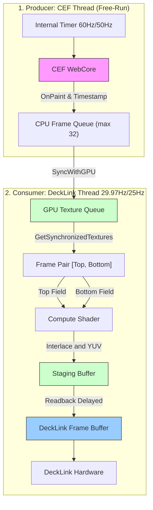

# Detailed Data Processing Flow Specification

This document describes the details of the data processing pipeline from CEF (Chromium Embedded Framework) rendering to DeckLink video output.
It focuses on the **driving triggers**, **operating rates**, and **synchronization mechanisms** of each stage based on the current implementation (CEF Free-Run + Stutter-Prevention Sync Mechanism).

---

## 1. System Architecture Overview

This system is a bridge application that delivers the output of a web rendering engine (CEF) running off-screen to broadcast hardware (DeckLink) that requires a strict fixed frame rate (59.94i or 50i).
It features a mechanism where the **CEF thread (Producer)** and the **DeckLink thread (Consumer)** run independently and synchronize efficiently and smoothly using a timestamped frame queue.

### Data Flow Diagram (Conceptual)

---

## 2. Buffering and Inter-Thread Synchronization Strategy

This application implements a synchronization logic (inspired by the CasparCG architecture) to deliver the smoothest motion possible while preventing frame drops and latency.

### Stage 1: CEF Rendering (Producer)
- **Responsible Classes**: `CefManager`, `CefRenderHandlerImpl`
- **Driving Trigger**: CEF internal timer (Free-Run)
- **Operating Rate**: **60 fps or 50 fps** (`windowless_frame_rate = 60` or `50`)
- **Logic**:
    - The legacy manual rendering drive (`DriveExternalBeginFrame`) has been deprecated. Rendering is now driven by CEF's own high-precision autonomous timer (Free-Run mode).
    - This bypasses the timing jitter caused by the Windows scheduler's 15.6ms timer resolution, realizing stable 60fps/50fps frame generation.
    - When copying pixel data in the `OnPaint` callback, the timestamp from `std::chrono::steady_clock` is recorded at that exact moment.

### Stage 2: GPU Upload and Synchronization Queue (Consumer 1)
- **Responsible Functions**: `CefRenderHandlerImpl::SyncWithGPU()`, `GetSynchronizedTextures()`
- **Driving Trigger**: Polled every frame cycle (approx. 33.36ms for 59.94i, 40.0ms for 50i) from within the DeckLink output callback (`ScheduledFrameCompleted`).
- **Logic**:
    - **Upload**: Uploads pending frames accumulated on the CEF side to D3D11 textures, and pushes them along with their timestamps to the queue (`m_readyTextures`).
    - **Pair Retrieval (Time-Based Preroll Mechanism)**:
        - When a new frame supply is detected (queue size increases from 0 to 1 or more), the system does not consume it immediately but introduces **a deliberate buffer delay (Preroll)**.
        - **During Normal Animation**: Several frames are banked in the queue during this preroll phase. Once consumption starts, even if the CEF rendering is momentarily delayed by OS timer jitter, frames can be pulled stably from this banked queue, completely absorbing micro-stutters.
        - **During Still Image output (Cut-in)**: Even if only a single frame is supplied by CEF with no succeeding frames, it is retrieved after the preroll delay and duplicated to both Top and Bottom fields to output a correct still image.
        - **When Animation Stops (Queue Starvation)**: When the CEF supply ceases and the queue runs empty (0 frames), the consumption phase ends and the preroll wait timer is reset. During waiting and prerolling, the "last displayed frame" is duplicated to both fields, preventing interlacing judder (time reversal) and maintaining a complete freeze.

---

## 3. View Mode (g_viewMode) and TUI Control

This system allows real-time switching of rendering styles, shader compute modes, and filter parameters via a console-based TUI (Text User Interface) using hotkeys with the `Ctrl` key modifier. Changed parameters are automatically saved to `config.json` and restored on the next startup.

| Mode Value | Output Mode Name | Operation Details |
| :---: | :--- | :--- |
| **0** | **Interlace (Standard)** | CEF runs at 60fps (or 50fps) free-run. The shader weaves consecutive frames and outputs them as a 1080i signal. |
| **1** | **Diff (Difference)** | CEF runs at 60fps (or 50fps) free-run. Outputs the absolute difference of consecutive frames (`abs(p1 - p2)`) to visualize only moving pixels. Becomes completely black when still. |
| **2** | **Progressive** | CEF runs at 60fps (or 50fps) free-run. The hardware outputs 29.97p/25p using only Frame 1. The window preview features a double-pumped 60p/50p preview. |
| **3** | **30p Blend** | Drops CEF consumption rate by half, and the shader blends consecutive frames at 50% each to generate a smooth motion blur. |

**TUI Hotkey List:**
- **`Ctrl + O`**: Cycle Output Mode (0-3 above).
- **`Ctrl + F`**: Cycle Internal Filter Mode (None -> 3tap -> 5tap).
- **`Ctrl + K`**: Toggle Keyer Mode (Internal / External).
- **`Ctrl + A` / `Ctrl + Z`**: Fine-tune Unmult Alpha Threshold (`g_alphaThreshold`) (+0.001 / -0.001).
- **`Ctrl + Up` / `Ctrl + Down`**: Coarse-tune Unmult Alpha Threshold (+0.1 / -0.1).
- **`Ctrl + R`**: Reload current URL.
- **`Ctrl + C`**: Safe exit.

*Note: The dashboard display is color-coded in real-time (Green, Yellow, Red) depending on the current format (59.94i / 50i), FPS, and queue starvation (skips).*

---

## 4. Shader Processing and Interlace Compositing (Consumer 2)

- **Responsible Class**: `ShaderManager`
- **Execution Thread**: DeckLink Video Output Thread
- **Operating Rate**: **29.97 fps or 25 fps (Interlaced Frame Generation)**
- **Logic**:
    1.  **Compute Shader Dispatch (`YUVConvert.hlsl`)**:
        - **Input**: Two consecutive progressive frames retrieved from `GetSynchronizedTextures()`.
            - `t0`: Older frame (applied to Top Field)
            - `t1`: Newer frame (applied to Bottom Field)
        - **Process**: 
            - Maps even lines from `t0` and odd lines from `t1` (Weave compositing).
            - Applies vertical blur for flicker reduction depending on the specified filter mode (3tap, 5tap).
            - Performs color space conversion from ARGB (RGB + Alpha) to YUV formats such as UYVY or v210.
            - Performs Unmultiplied Alpha processing (separating Fill and Key) based on the `--alpha` threshold argument.
        - **Output**: A texture for a single interlaced frame (59.94i or 50i).
    
    2.  **Pipelined Readback**:
        - Reading back data from the GPU to CPU memory (DeckLink buffer) is a very heavy operation.
        - To prevent performance degradation, the staging buffer that completed processing **2 frames ago (in terms of output frames)** is mapped and read.
        - The read data is copied to the DeckLink output buffer (`pBuffer`) via `memcpy`.

---

## 5. Frame Latency and Sequence

**60p/50p -> 59.94i/50i Conversion and Output Flow**

Overall, there is an **intentional pipeline delay (approx. 2 Ticks + CEF buffer sync preroll delay)** from when a frame is rendered in CEF to when it is actually output from the DeckLink hardware.

| Time Axis (DL Tick) | Action (within DL Thread) | Status |
| :--- | :--- | :--- |
| **Tick N** | Pulls pair (A, B) from CEF queue and uploads to VRAM. `ShaderManager` composites them into `Staging[0]`. | `Staging[0]` begins rendering on GPU. |
| **Tick N+1** | Pulls next pair (C, D) and uploads to VRAM. `ShaderManager` composites them into `Staging[1]`. | `Staging[1]` begins rendering. |
| **Tick N+2** | Pulls next pair (E, F) and uploads to VRAM. **Asynchronous Readback from `Staging[0]` to CPU.** Schedules to DeckLink. | **`Staging[0]` (generated at Tick N) is output from hardware.** |

This guarantees smooth broadcast-quality motion with a temporal resolution of 60Hz/50Hz, while achieving a throughput of 29.97fps/25fps (Interlaced) without blocking any threads.

---

## 6. Stabilization and Performance Optimization

1.  **Process Priority and Thread Control**:
    - Set to `HIGH_PRIORITY_CLASS` to secure prioritized CPU scheduling by the OS.
    - The CEF rendering thread (Free-Run) and the DeckLink output callback thread (driven by 29.97Hz/25Hz hardware timer) run completely independently, passing data asynchronously via the timestamped queue.
2.  **Disabling Background Throttling**:
    - Startup options such as `--disable-renderer-backgrounding` and `--disable-background-timer-throttling` are applied so CEF keeps running even when the window is hidden.
    - **Note**: To maintain the precise internal timer of CEF (60fps/50fps), options like `--disable-frame-rate-limit` or `--disable-gpu-vsync` are not used.
3.  **Keep-Alive Rendering After Page Load**:
    - CEF stops rendering when there are no visual updates on screen. To guarantee a constant frame supply, a dummy script that animates a microscopic element is injected upon page load (`OnLoadEnd`) to continuously trigger paint events (`OnPaint`).
4.  **UI Monitoring and Logging**:
    - System metrics per second (FPS, Queue size, skips, etc.) and the current URL configuration are gathered in the main loop (`RenderFrame` in `main.cpp`) and displayed on the console in real-time.
    - During ideal free-run operation, the CEF FPS maintains the target rate (60 or 50) while animations are playing, and the queue size is consumed stably.
